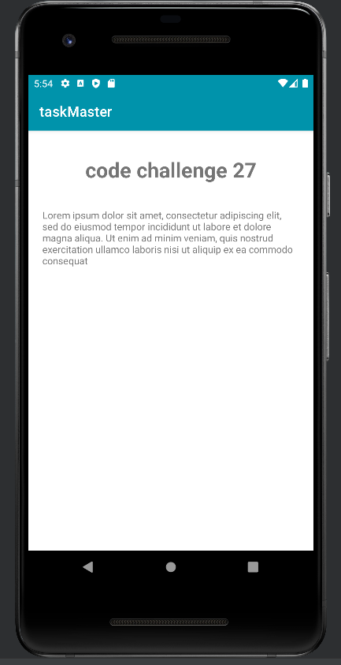
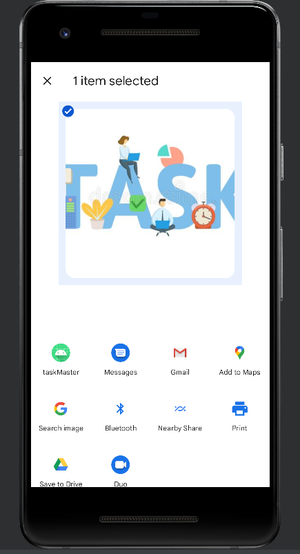

# taskmaster
java android project about creating task master android app using intent , toast 

## lab 26

### home page

page with tow buttons one to add new task and one to show all tasks

### All tasks page

page to show all tasks

### Add task page

page to add new task allow the user to inter the task title and description 

## lab 27

### Task Detail Page
page to show task information 

### Settings Page

page allow the user to inter his/her name

### screenshot

# lab 28
update home page to use recycler view 

### screenshot

# lab 29 
use Room Library to store and retrieve persistence date and render it in recycler view

### add task Page 
add spinner to it so user can choose the state of his task

### setting Page 
the user can choose number of task he want to see in home page 

# lab 31

## testing the interfaces using espresso tool 

# lab 32

adding amplify to the project and configure with dynamoDb

## add task page 
 adding the task detail to the cloud database
 
## home page 
make recyclerView read from the cloud 

### screenshot

# lab 33
adding relation to the database model like **hasMany**

### screenshot

# lab 36

adding sign up and login by using aws cognito

### screenshot

sign up page

login page 

cognito

# lab37

allow the user to upload picture using S3 AWS storage

### screenshot

# lab 38 
allow the user to share image using task master app

### screenshot

# lab 39 
allow the user to add the location using google services api 

### screenshot

# lab 41
add more aws api services like convert text to speech and Analytics

### screenshot

